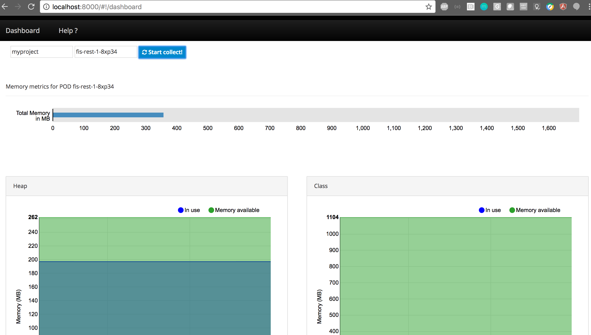
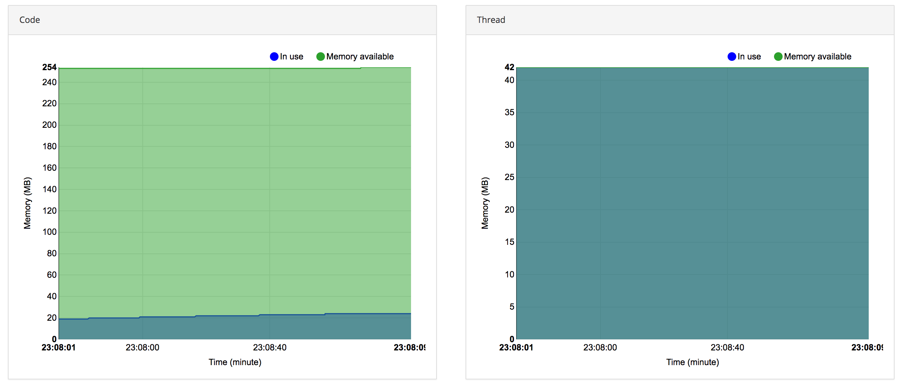

# Java Memory Tracking Analyzer

This tool is responsible for crawling Java memory tracking reports in containized environments using Kubernetes. 

It summarizes those statistics and display it in a dashboard.

It's helpful to do tuning, find memory leaks, etc.




## Requirements

### oc client

This version is tigh acoppled with Kubernetes/Openshift/Origin, so you need `oc client`

Before start the analisys you need to be already logged in in the kubernetes system.

```
    oc login -u <user> https://<your-kubernetes-master-url>.com:8443
```

Your java application under analisys must have the parameter `-XX:NativeMemoryTracking=summary` 

## Build and run

### Backend (API)

```
    cd jmt-api
    npm install
    npm start run 
```

It starts a server in http://localhost:3000

### Frontend (UI)

```
    cd jmt-ui
    npm install
    npm start run 
```

With both running you now can access the dashboard: http://localhost:8000

